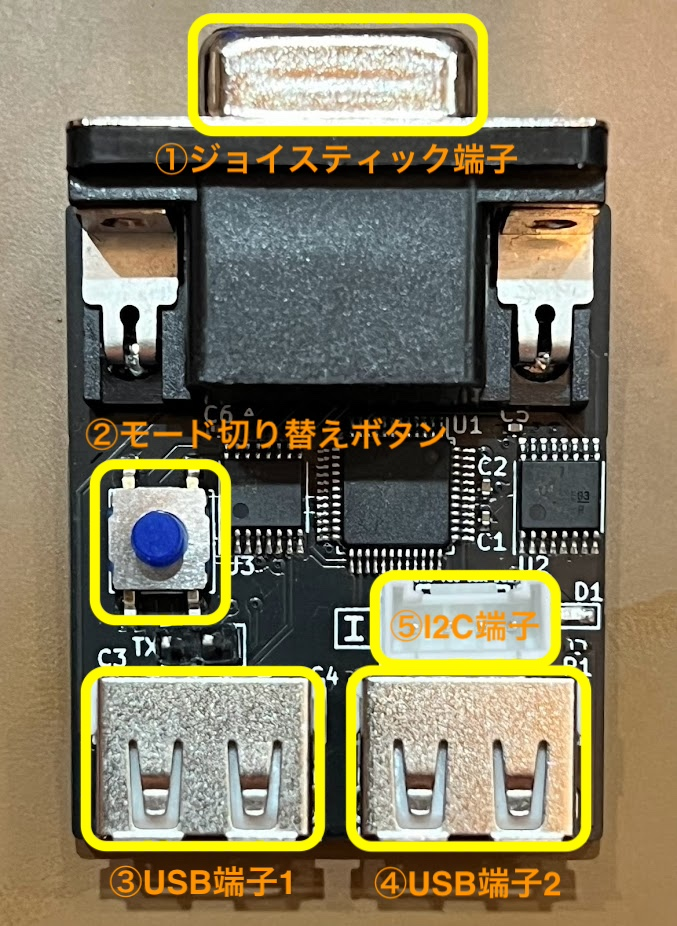

{: align="center"}

[暫定版PDF簡易マニュアル](papers/draft.pdf)

# 取り扱い説明書
---
## 概要
USBのゲームコントローラをアタリ系ジョイスティックポートに変換する装置です。

Xbox系やPS系を始めとする多くのUSBゲームコントローラに対応し（*1）、アナログ入力含めて柔軟に再割り当てを行い、X68kやMSXなどで利用しているアタリ仕様端子に変換します。

基本的なアタリ仕様に加えて、CPSFの6ボタンや、サイバースティック、チェルノブアダプタを使ったメガドライブ3B/6B仕様をエミュレートできます。

(*1) USBゲームコントローラの仕様は多岐に渡り、仕様をまもっていないもの、固有のコマンドを送らないと動作しないようプロテクトが掛かっているものなどがあるため、全てのコントローラでの動作を保証するものではありません。

## 各部の説明

### ①ジョイスティック端子
X68kやMSXなどと接続します。ここから電源も供給されます。

### ②モード切り替えボタン
各動作モードの切り替えを行います。選択中のモードは電源を切っても記録されます。

### ③USB端子1
ゲームコントローラを接続します。

公式にサポートしているコントローラについては姉妹品IONA-USサポートページ内にある
[ファームウェアの互換性](https://toyoshim.github.io/iona-us/firmware)をご確認ください。
これ以外でも多くのコントローラが動作します。

PCと接続する際にも利用しますが、その際①は必ず切り離してください。

### ④USB端子2

未使用、将来の拡張用です。いずれ2P対応やコントローラ以外のUSBデバイスをサポートする可能性があります。

### ⑤I2C端子

I2C規格に則った通信ができます。主に開発者向けの機能です。
簡単な技術情報は[GitHub内のWiki](https://github.com/toyoshim/Moonshot/wiki/I2C-Support)に書かれています。興味ある方はお気軽にお声がけください。

現在はデバイスとして動作しますが、将来的にはホストとしてI2Cデバイスを制御する機能を追加する予定です。

## 動作モード詳細

| LEDの状態 | 動作モード | 概要 |
|-|-|-|
| 点灯 | 通常モード | 標準的な2ボタンと上下・左右同時押しを利用したSTART/SELECTボタンに対応しています。CPSF等の変換器が用いていた6ボタン拡張にも対応しています。 |
| 高速点滅 | サイバースティックモード | サイバースティック互換のアナログ対応モードです。4軸全て動作します。動作確認状況については[こちら](https://github.com/toyoshim/Moonshot/wiki/%E4%BA%92%E6%8F%9B%E6%80%A7%E7%A2%BA%E8%AA%8D%E7%8A%B6%E6%B3%81)をご確認ください。またmsconf.xなどのツールはこのモードでサイバースティックのプロトコルを拡張して動作します。|
| 低速点滅 | 低速通信モード | じょいぽーとU君に対応したエミュレータやX68000Zで利用するためのモードです。|
| 2回点滅 | メガドライブモード | チェルノブコンバーターを用いてメガドライブ用のコントローラをアタリ端子に変換した時の動作をエミュレートします。6ボタンプロトコルにも対応しています。|

## レイアウト変更
[X68kから利用するツール](https://github.com/toyoshim/Moonshot/tree/main/tools)と
同ツールをウェブから利用できるようにした[ページ](setting)があります。

{: align="center"}

# 将来できるかもしれないこと
---
- 専用ドライバを使い右側のポートを2P用に利用
  + IOCSをフックする予定なので、直接I/Oを叩いたゲーム等には対応できません
- 同様にしてキーボード、マウスに対応
- USBハブを経由した接続に対応
- I2Cを用いた機器の制御
- [x68kzremotedrv](https://github.com/yunkya2/x68kzremotedrv)のマウント

# Special Thanks
---
βテストで沢山の方にご協力頂きました。お名前の掲載を許可頂いた方のみ掲載させて頂きます。
協力していただいたすべての方に感謝します。
また、購入して頂いた方も、ぜひフィードバックで改善にご協力お願いします。
特殊入力に対応したゲームを作りたい方、X68k以外のプラットフォームでのツールを作りたい方、I2Cモードで使ってみたい方なども遠慮なくご相談ください。
アップデート可能なデバイスですので、色々と楽しくしていけたらと思います。

- [くにちこ](https://twitter.com/kunichiko)
- [たんぼ（TNB製作所）](https://twitter.com/h_koma2)
- 前廣和豊
- [みゆ🌹ฅ^•ω•^ฅ (miyu rose) ](https://twitter.com/arith_rose)

（継承略、五十音順）